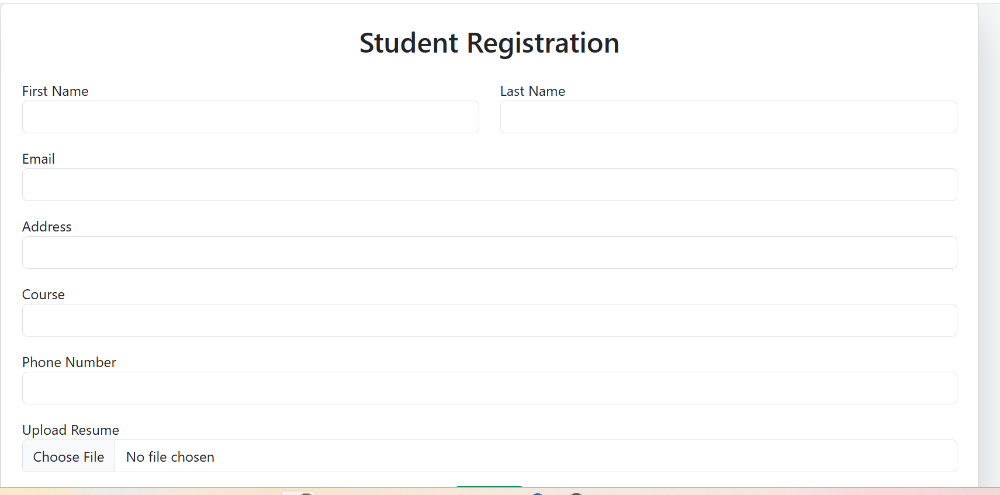

# 🔐 Login Form (React Native)

A simple and responsive **Login Form** built using **React Native** and **Expo**.  
This project allows users to log in using their email and password.

---

## 🚀 Features
- User-friendly login screen  
- Input validation for email and password  
- Built with Expo (easy to run on Android, iOS, or Web)  
- Simple and clean UI  

---

## 🖼️ Screenshot



*(Add your screenshot image in the `assets` folder and name it `login-screenshot.png`)*

---

## 🛠️ Technologies Used
- React Native  
- Expo  
- JavaScript / TypeScript  

---

## ⚙️ How to Run the Project

1. **Clone the repository**
   ```bash
   git clone https://github.com/your-username/login-form.git
